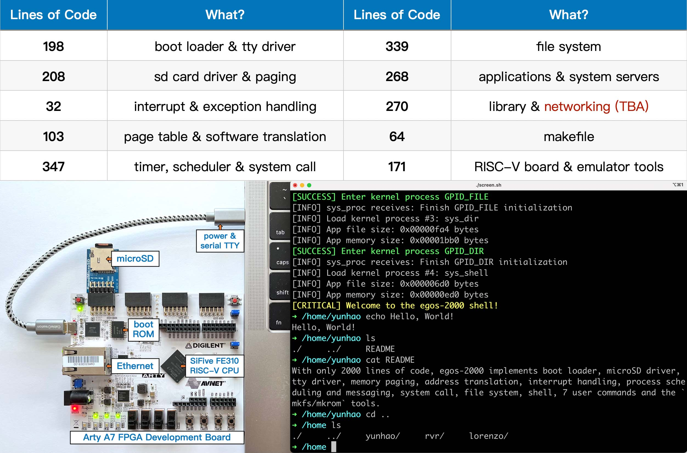

# A minimal operating system on a small RISC-V board

With only **2000** lines of code, **egos-2000** implements every component of a functional operating system.
It runs on a **$129** small development board with a RISC-V processor.

| Lines of Code | What?                                  | Lines of Code | What?                     |
|:-------------:|----------------------------------------|:-------------:|---------------------------|
|      222      | SD card driver                         |      264      | 11 Applications           |
|       48      | Exception handling                     |      262      | Library                   |
|      106      | Memory management                      |       54      | Makefile                  |
|      358      | Grass kernel (scheduler + system call) |      172      | FPGA board-specific tools |
|      339      | File system                            |      175      | Other (boot loader, etc.) |

## Earth and Grass Operating System 2000

**egos** and **egos-2000** are the teaching operating systems we use at Cornell. They have the same architecture.

* The **earth layer** implements hardware-specific abstractions.
    * tty and disk device interfaces
    * cpu interrupt and memory management interfaces
* The **grass layer** implements hardware-independent abstractions.
    * processes, system calls and inter-process communication
* The **application layer** implements file system, shell and user commands.

The definitions of `struct earth` and `struct grass` in [**egos.h**](library/egos.h) specify the interfaces between these layers.

### Hardware Requirements
* an Artix-7 35T [Arty FPGA development board](https://www.xilinx.com/products/boards-and-kits/arty.html)
* a microUSB cable (e.g., [microUSB-to-USB](https://www.amazon.com/CableCreation-Charging-Shielded-Charger-Compatible/dp/B07CKXQ9NB?ref_=ast_sto_dp&th=1&psc=1) or [microUSB-to-USB-C](https://www.amazon.com/dp/B0744BKDRD?psc=1&ref=ppx_yo2_dt_b_product_details))
* [optional] a [microSD Pmod](https://digilent.com/reference/pmod/pmodmicrosd/start?redirect=1), a [microSD reader](https://www.amazon.com/dp/B07G5JV2B5?psc=1&ref=ppx_yo2_dt_b_product_details) and a microSD card (e.g., [Sandisk](https://www.amazon.com/dp/B073K14CVB?ref=ppx_yo2_dt_b_product_details&th=1), [Samsung](https://www.amazon.com/dp/B09B1F9L52?ref=ppx_yo2_dt_b_product_details&th=1) or [PNY](https://www.amazon.com/dp/B08RG87JN5?ref=ppx_yo2_dt_b_product_details&th=1))

### Usages and Documentation

For compiling and running egos-2000, please read [USAGES.md](references/USAGES.md) or watch the tutorial videos ([MacOS](https://youtu.be/v8PW2N5edCc), [Linux](https://youtu.be/JDApdvnnz4A) or [Windows](https://youtu.be/VTTynr9MZRg)).
[This document](references/README.md) further introduces the teaching plans, architecture and development history.

The [RISC-V instruction set manual](references/riscv-privileged-v1.10.pdf) introduces the privileged registers used by egos-2000.
The [SiFive FE310 manual](references/sifive-fe310-v19p04.pdf) introduces the processor used by egos-2000, especially the GPIO, UART and SPI bus controllers.

For any questions, please contact [Yunhao Zhang](https://dolobyte.net/).

## Acknowledgements

Many thanks to [Robbert van Renesse](https://www.cs.cornell.edu/home/rvr/) and [Lorenzo Alvisi](https://www.cs.cornell.edu/lorenzo/) for their support.
Many thanks to [Meta](https://about.facebook.com/meta/) for supporting me with a [fellowship](https://research.facebook.com/fellows/zhang-yunhao/).
Many thanks to all CS4411 students at Cornell over the years for helping improve this course.
