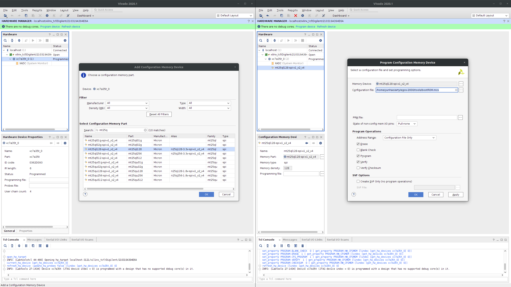
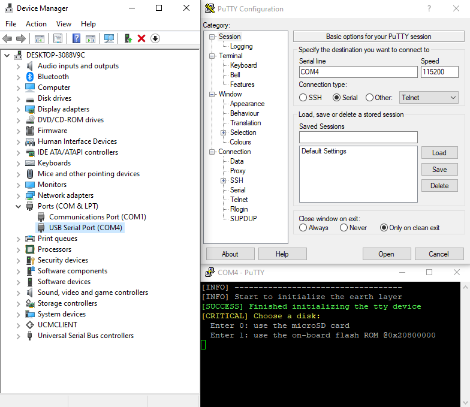

# Compile and run egos-2000

You can use MacOS, Linux or Windows. 
For MacOS on the Apple Arm chip, just download and run the `x86-64` version of the toolchain and MacOS will transparently translate the binary to Arm.
For Windows users, use WSL (Windows Subsystem for Linux) in step1-3.

Here are the tutorial videos for [MacOS](https://youtu.be/v8PW2N5edCc), [Linux](https://youtu.be/JDApdvnnz4A) and [Windows](https://youtu.be/VTTynr9MZRg).
These videos skipped step3 and regarded step4 as step3 since QEMU support is a new feature. And step3 in this document is easy to follow.

**egos-2000** can run on both QEMU and a RISC-V board. 
Running on QEMU is easier, but
if you wish to run it on the board for more fun, 
you will need to purchase the following hardware:
* an Artix-7 35T [Arty FPGA development board](https://www.xilinx.com/products/boards-and-kits/arty.html)
* a microUSB cable (e.g., [microUSB-to-USB-C](https://www.amazon.com/dp/B0744BKDRD?psc=1&ref=ppx_yo2_dt_b_product_details))
* [optional] a [microSD Pmod](https://digilent.com/reference/pmod/pmodmicrosd/start?redirect=1), a [microSD reader](https://www.amazon.com/dp/B07G5JV2B5?psc=1&ref=ppx_yo2_dt_b_product_details) and a microSD card (e.g., [Sandisk](https://www.amazon.com/dp/B073K14CVB?ref=ppx_yo2_dt_b_product_details&th=1))

## Step1: Setup the compiler and compile egos-2000

Setup your working directory and name it as `$EGOS`.

```shell
> export EGOS=/home/yunhao/egos
> cd $EGOS
> git clone https://github.com/yhzhang0128/egos-2000.git
# now the code repository is at $EGOS/egos-2000
```

Download the [SiFive riscv-gcc compiler](https://github.com/sifive/freedom-tools/releases/tag/v2020.04.0-Toolchain.Only) to the working directory `$EGOS`.

```shell
> cd $EGOS
> tar -zxvf riscv64-unknown-elf-gcc-8.3.0-2020.04.1-x86_64-xxx-xxx.tar.gz
> export PATH=$PATH:$EGOS/riscv64-unknown...../bin
> cd $EGOS/egos-2000
> make
mkdir -p build/debug build/release
......
```

After this step, `build/release` holds the ELF format binary executables and `build/debug` holds the human readable assembly files.

## Step2: Create the disk and bootROM images

Make sure you have a C compiler (i.e., the `cc` command) in your shell environment.

```shell
> cd $EGOS/egos-2000
> make install
-------- Create the Disk Image --------
......
[INFO] Finish making the disk image
-------- Create the BootROM Image --------
......
[INFO] Finish making the bootROM binary
[INFO] Finish making the bootROM mcs image
```

This will create `disk.img`, `bootROM.bin` and `bootROM.mcs` in the `tools` directory.
You can use [balena Etcher](https://www.balena.io/etcher/) or the `dd` shell command to program `disk.img` to your microSD card.

## Step3: Run egos-2000 on the QEMU emulator

Download the [QEMU emulator for egos-2000](https://github.com/yhzhang0128/freedom-tools/releases/tag/v2022.10.6) to the working directory `$EGOS`.

```shell
> cd $EGOS
> tar -zxvf riscv-qemu-xxx.tar.gz
> export PATH=$PATH:$EGOS/riscv-qemu-5.2.0-...../bin
> cd $EGOS/egos-2000
> make qemu
-------- Simulate on QEMU-RISCV --------
cp build/release/earth.elf tools/qemu/qemu.elf
riscv64-unknown-elf-objcopy --update-section .image=tools/disk.img tools/qemu/qemu.elf
qemu-system-riscv32 -readconfig tools/qemu/sifive-e31.cfg -kernel tools/qemu/qemu.elf -nographic
[INFO] -----------------------------------
[INFO] Start to initialize the earth layer
......
```


## Step4: Run egos-2000 on the Arty board

### Step4.1 Program the Arty on-board ROM

#### Step4.1.1 MacOS or Linux

Download [OpenOCD v0.11.0-1](https://github.com/xpack-dev-tools/openocd-xpack/releases/tag/v0.11.0-1) to the working directory `$EGOS`.

```shell
> cd $EGOS
> tar -zxvf xpack-openocd-0.11.0-1-xxx-xxx.tar.gz
> export PATH=$PATH:$EGOS/xpack-openocd-0.11.0-1-xxx-xxx/bin
> cd $EGOS/egos-2000
> make program
-------- Program the on-board ROM --------
cd tools/openocd; time openocd -f 7series.txt
......
Info : sector 188 took 223 ms
Info : sector 189 took 223 ms
Info : sector 190 took 229 ms
Info : sector 191 took 243 ms  # It will pause at this point for a while
Info : Found flash device 'micron n25q128' (ID 0x0018ba20)

real    2m51.019s
user    0m11.540s
sys     0m37.338s

```

#### Step4.1.2 Windows or Linux
Install Vivado Lab Edition which can be downloaded [here](https://www.xilinx.com/support/download.html).
You may need to register a Xilinx account, but the software is free.

1. Open Vivado Lab Edition and click "Open Hardware Manager"
2. Click "Open target" and "Auto Connect"; the Arty board should appear in the "Hardware" window
3. In the "Hardware" window, right click `xc7a35t` and click "Add Configuration Memory Device"
4. Choose memory device "mt25ql128-spi-x1_x2_x4" and click "Program Configuration Memory Device"
5. In the "Configuration file" field, choose the `bootROM.mcs` file compiled in step 2
6. Click "OK" and wait for the program to finish

In **4**, new versions of Arty may use "s25fl128sxxxxxx0" as memory device. 
If you choose the wrong one, **6** will tell you.

In **2**, if the Arty board doesn't appear, try to install [Digilent Adept](https://digilent.com/reference/software/adept/start) or reinstall the USB cable drivers following [these instructions](https://support.xilinx.com/s/article/59128?language=en_US). If it still doesn't work, it may be an issue with Vivado and please [contact Xilinx](https://support.xilinx.com/s/topic/0TO2E000000YKXgWAO/programmable-logic-io-bootconfiguration?language=en_US).



### Step4.2: Connect to egos-2000 on the Arty board

1. After step4.1, Press the `PROG` red button on the left-top corner of the Arty board
2. To restart, press the `RESET` red button on the right-top corner
3. For Linux users, type in your shell
```shell
> sudo chmod 666 /dev/ttyUSB1
> screen /dev/ttyUSB1 115200
[INFO] -----------------------------------
[INFO] Start to initialize the earth layer
[SUCCESS] Finished initializing the tty device
[CRITICAL] Choose a disk:
  Enter 0: use the microSD card
  Enter 1: use the on-board flash ROM @0x20800000
......
```
4. For MacOS users, use the same commands but check your `/dev` directory for the  device name (e.g., `/dev/tty.usbserial-xxxxxx`)
5. For Windows users, find the board in your "Device Manager" (e.g., COM4) and use `PuTTY` to connect with the board with the following configuration:


